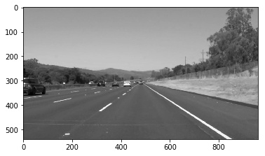
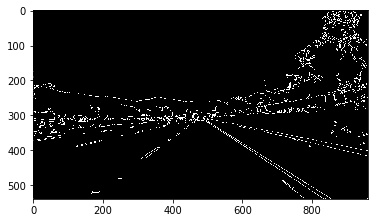
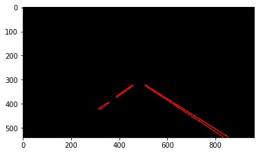

## Introduction

The goal of this first project was to create a simple pipeline to detect road lines in a frame taken from a roof-mounted camera.

Being the very first project, the pipeline is necessarily very simple. No machine learning is involved - just computer vision and a lot of boring manual parameter tuning. :-)

## Dependencies

cv2(python3) >= 3.2.0

The Project
---


**Step 1:** Grayscale processing

Calling the cvtColor () function provided in OpenCV can easily process the gray level of the image.  
```
gray = cv2.cvtColor(img, cv2.COLOR_BGR2GRAY)
```   
The grayscale processed image as below:


**Step 2:** Edge extraction

Commonly used edge extraction algorithms include Canny edge detector and Sobel algorithms. They only have different calculation methods, but their functions are similar.  
Taking Canny edge detector as an example, after selecting a specific threshold, the gray image is processed to obtain an effect map of edge extraction.  
```
low_threshold = 40
high_threshold = 150
canny_image = cv2.Canny(gray, low_threshold, high_threshold)
```  




**Step 3:** Region of Interest Selection

After the edge extraction is completed, the lane lines to be detected are highlighted. In order to detect the lane line from the lane where the car is located, we need to extract the Region of Interest. The simplest way to extract the region of interest is to "intercept".  


```
im_shape = image.shape
vertices = np.array([[(0, im_shape[0]), (int(0.45 * im_shape[1]), int(0.6 * im_shape[0])), (int(0.57*im_shape[1]), int(0.6 * im_shape[0])), (im_shape[1], im_shape[0])]], dtype=np.int32)
mask_edges = region_of_interest(edges, vertices)
```


**Step 4:** Hough Transform

After gray scale processing, edge detection and region of interest interception, we finally extracted the left and right lane lines from the complex image. Next, we use Hough transform to extract straight lines in the image.

```
    rho=1
    theta = np.pi/180
    threshold = 40
    min_line_len = 40
    max_line_gap = 20
    line_image = hough_lines(mask_edges, rho, theta, threshold, min_line_len, max_line_gap)
```



**Step 5:** Data processing

A series of line segment results obtained by Hough transform are still somewhat different from our output results. In order to solve these differences, we need to do some post-processing operations on the data we detected.

Data processing is based on the following two points:

1. Calculate the straight line equation of left and right lane lines
2. Calculate the upper and lower boundaries of left and right lane lines


<video width="960" height="540" controls>
  <source src="{0}">
</video>
